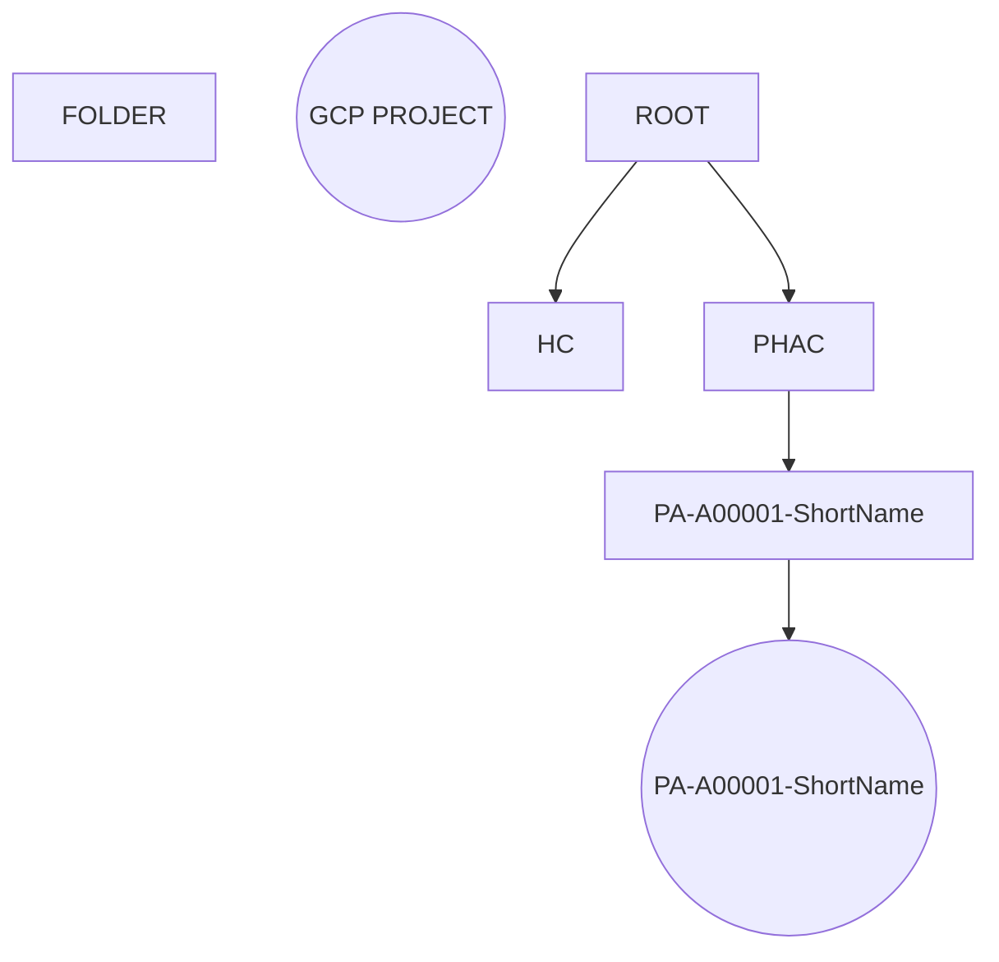
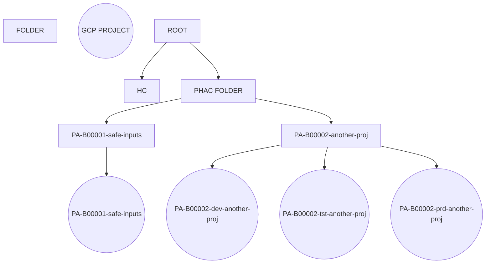

<!--- Original outline generated by ChatGPT+ --->
# Concept of Operations Document for Cloud Operations
> :warning: **ChatGPT+ generated this outline**
>
> There may be sections below we don't need or don't make sense to us.  We can adjust/remove/rename as necessary.

> :warning: **This is a living document**:  
> This is subject to frequent updates as we are still in the early days of fleshing out how our operations will work.
> 
> In this early draft I will be using blockquote syntax to help wrestle with ideas and considerations.  In future drafts they will be removed where appropriate and their use will be the "proper" use of them.  For now I need certain things to stand out while putting things together.

> :question: **I would welcome any thoughts and suggestions as to how we should (if at all - and I think it is likely) partition sections of this document as things relate to UCLL and PBMM.**

## I. Introduction
### Purpose of the document
> :warning: **START ChatGPT generated paragraph**
>
> The purpose of this Concept of Operations document is to provide a comprehensive overview of the cloud operations processes and procedures for managing and maintaining a cloud-based infrastructure. This document serves as a guide for the cloud operations team and outlines the roles and responsibilities of the team, the processes for managing incidents, changes, capacity planning, and disaster recovery and business continuity. In addition, this document provides information on the cloud services being used, the cloud provider's infrastructure, security features, availability features, and service level agreements. This document is intended to ensure that the cloud infrastructure is managed efficiently and effectively, and that the necessary measures are in place to maintain the security, availability, and reliability of the cloud environment.
>
> :warning: **END ChatGPT generated paragraph**

> :question: **Scoping of this should be restricted to GCP?**
>
> If we incorporate multiple CSPs it could get very messy.  There should be commonality of topics, but implementation and coverage can be different based on vendor stacks/services.
### Scope of the document
> :warning: **START ChatGPT generated paragraph**
>
> The scope of this Concept of Operations document covers the management and maintenance of a cloud-based infrastructure, specifically focused on the operations team responsible for managing the cloud environment. This document outlines the processes, procedures, tools, and security controls that are necessary to maintain the reliability, availability, and security of the cloud infrastructure. The document covers the cloud services being used, the cloud provider's infrastructure, security features, availability features, and service level agreements. It also outlines the roles and responsibilities of the cloud operations team, including their communication channels and escalation procedures. This document is intended for use by the cloud operations team, as well as other stakeholders who need to understand the processes and procedures for managing and maintaining the cloud infrastructure.
> 
> :warning: **END ChatGPT generated paragraph**
### Overview of cloud operations
> :exclamation: I am struggling a bit to get a proper perspective on this header.

> :warning: **START ChatGPT generated paragraph**
> 
> Cloud operations refer to the processes and procedures involved in managing and maintaining a cloud-based infrastructure. This includes managing the cloud services being used, monitoring the infrastructure, maintaining security and compliance, and ensuring the availability and reliability of the cloud environment. Cloud operations also involve managing incidents and changes, capacity planning, and disaster recovery and business continuity planning. In addition, cloud operations require a team of experts with the necessary skills and tools to manage and maintain the cloud infrastructure effectively. Overall, cloud operations play a critical role in ensuring that the cloud infrastructure is reliable, secure, and available to support the organization's business operations.
> 
> :warning: **END ChatGPT generated paragraph**
## II. Cloud Infrastructure
### Description of the cloud infrastructure
> :exclamation: We can likely pull some summary info from GCP itself and then add reference links to appropriate official documentation instead of regurgitating a bunch of it here and having to unneeded maintenance to keep it aligned with the official description...
### Overview of the cloud provider's infrastructure
> See above?
### Overview of the cloud provider's security features
> See above?  Michael may have a series of links that may save us time to get this section figured out.
### Overview of the cloud provider's availability features
> Ask Michael about this one as well??????

## III. Cloud Services
> :question: The context of this whole section might need to be re-thought?
> 
> Should this be from the GCP perspective?  I suppose we should document certain aspects of GCP, but if CCCS has already vetted them, then how deep do we need to go into describing the vendor for our ConOps?
### Description of the cloud services being used
> :question: Can we even tailor this?  GCP has so many services... can we identify upfront beyond a few core services? i.e. GKE??

> :exclamation: Something like Istio isn't really a service offering (is it? @Michael's input here?), but will be needed to meet security controls in some scenarios.
### Overview of the cloud provider's service level agreements (SLAs)
> See above.  We should link to GCP SLAs if appropriate, but we should also decide what SLAs we will have for our own PHAC clients.
>
> :question: Should this be a link to a separate SLA document?  My answer is yes.
### Overview of the cloud provider's support services
> :question:  Overview here, link to expansive document here?
### Overview of the cloud provider's billing services
> :question: This is a good one. I am in the camp that eventually the business entity that "owns" a GCP project should get their own billing ID and become directly responsible for their burn-rate.  I am not sure this is a view shared by everyone.

## IV. Cloud Operations Team
### Description of the cloud operations team
> :question: Should this be focussed on cloud infra?  I.e. John and Keith (at the moment??)  If yes, where do we document the overall team and its interfacing points?

> :warning: **START ChatGPT generated paragraph**
>
>The cloud operations team is responsible for managing and maintaining the cloud infrastructure and ensuring that the cloud services are available, secure, and reliable. The team consists of experts with specialized skills in cloud operations, such as system administrators, network engineers, security analysts, and developers. The team works closely with other stakeholders, such as application developers, IT operations, and business owners, to ensure that the cloud services are meeting the needs of the organization. The cloud operations team is responsible for monitoring the cloud infrastructure, managing incidents and changes, capacity planning, and disaster recovery and business continuity planning. The team communicates with other stakeholders through various channels, such as email, phone, chat, and collaboration tools, and has established escalation procedures to ensure that issues are resolved in a timely and effective manner. Overall, the cloud operations team plays a critical role in ensuring that the cloud environment is managed efficiently and effectively to support the organization's business operations.
>
> :warning: **END ChatGPT generated paragraph**

### Roles and responsibilities of the cloud operations team
> The answer to this can/will be driven by the above questions.
> 
> :exclamation: John, Michael and Keith should be able to drive some answers into this section at the very least from what we are seeing from an infrastructure lens.
### Overview of the cloud operations team's communication channels
> :exclamation: John has already started driving this forward with the creation of some Slack-based support channels. 
> 
> @TODO John can add some depth here.  I think he may have already created some Wiki pages to help describe a support vision.
### Overview of the cloud operations team's escalation procedures
> :exclamation: :question:  This is a really good question.  Do we escalate directly to Google for things, or are we required to proxy everything via HC?
>
> :question: **Do we have our own support vehicle with GCP?**

## V. Cloud Operations Processes
### Overview of the cloud operations processes
> Processes to consider
> - onboarding - for the purpose of this document, our concern is the technical onboarding, not the business level.
> - ALM (do we interface to this in a significant way?) If an app (GCP Project) is lifecycled, what role do we play in cleaning up resources.  Are we simply deleting the Folder and all its contents?
> - support 
> - escalation
> 
> Initial guesswork processes have been drawn up for the technical side.  They are not final by any means.
>
> :exclamation: @TODO Keith: add diagrams into the wiki repo and link them here. Add numbers to each box in the diagram to allow linking of a box in the diagram to notes here where appropriate.
> :exclamation: We should document things like "HC has responsiblity for creating accounts" in this section?  It certainly is accounted for in the swimlane process diagram.

#### Technical Intake

##### Notes on suggested naming convention:
- **_possible_** naming standard: PA-(A|B)#####-text
    - ex. PA-A00001-safe-inputs, PA-B00001-safe-inputs
    - PA is derived from first letters of PHAC-ASPC
    - A00001 is a unique identifier. 
        - A shows the folder/project came via the simple (automated) intake.
        - B shows it came from the longer business intake process via DST
    - "safe-inputs" is a label that can be added to give quick context for a human reader.  This is probably optional????
    - the same naming standard is applied to the folder and GCP project with one exception. If the request asks for multiple projects to allow for a more traditional dev/test/prod setup, there is an additional string inserted into the naming of the projects created:
        - PA-B00001-dev-safe-inputs
        - PA-B00001-tst-safe-inputs (test could be used - we just have to agree to our standard)
        - PA-B00001-prd-safe-inputs (prod could be used - we just have to agree to our standard)
        - The multi GCP project scenario should only be possible in the complex intake process as it is envisioned right now.
> :question: Should we add "-prd" to intakes where only one project is created?
>
> :question: Will we have a "sandbox" (or any other environment) that doesn't fit with what I have outlined above?

##### Automation of GCP project creation (simple)
- Client visits a self-serve portal and selects from a form-based "menu" of options.
- There is some metadata required in this process.
    - **Client Contact (technical)**. Required. Email address??
    - **Client Contact (business)**. Required. Email address?
    - **Short name**. Helpful for human readability.
    - :exclamation: **NOTE**: I can imagine we may use the form to identify what working group the user is part of.  If the simple process begins to get abused, then this data may be used to send an email to a manager asking for a quick yes/no to the user being able to spin up processing resources.  This will not be the default out of the gate.
> :exclamation: John already started a reference for possible metadata terms (he is referencing them as tags). Do we keep them external, or add them to the ConOps??

[[Cloud-Tagging-Standard]]

- Once form is submitted an automated process kicks off to create the folder and project.

- After a certain boundary limit (time/money??)  The resources are all destroyed/cleaned up/deleted.
> :exclamation: @TODO We really need to flesh out the boundary limits for a simple intake.  SUGGESTIONS WELCOME!
##### Automation of GCP project creation (complex)
- Technical intake form completed (all fields TBD).  We can confidently say we would like a few specific data points.
    - **Business intake ID**. This is required if a project comes via DST.  Can we make this optional?  Or should it be required for internal services for ourselves for consistency?  This would likely mean we have a fast path via the DST team to simply add our internal delivery to their tracking list and bypass the weekly committee meeting.  Doing this will allow for consistency in naming conventions.
    - **Billing ID**.  This optional.  If none is supplied, our autmated process will use the base PHAC billing ID.
    - **Client Contact (technical)**. Required. Email address??
    - **Client Contact (business)**. Required. Email address?
    - How many project spaces required?  This is a reflection that a trunk-based development approach would/should only need one environment.  However, some project styles might prefer a more traditional dev/test/prod setup.  This answer will directly affect the outputs of the automation.
> :exclamation: John already started a reference for possible metadata terms (he is referencing them as tags). Do we keep them external, or add them to the ConOps??

[[Cloud-Tagging-Standard]]

- An automation process kicks off that: 
    - creates a folder under the PHAC folder based on our naming standard.
    - Once the folder is created the process will then create one or more GCP projects in that folder. **Metadata is assigned at the project level**.  Each project will have metadata attached that represents the Business intake ID, Billing ID, Client-contact-technical, and client-contact-business.

- Once the automation process has completed the creation of the GCP project(s) the client should receive an email letting them know the environment is ready.
- **NOTE**: If the client(s) does(do) not have a GCP account, then the process isn't started until they do.  This will have to be injected into the business intake when there is a decision that GCP is the place to host.
### Incident management process
> This is an interesting topic. What happens if a client is behaving badly (i.e. potentially breaks PBMM boundaries).  How should this be handled?  Is this even the correct section for this specific question?  Other types of incidents?
### Change management process
> We should document our change management here (i.e. driven through IaD, etc.) as Michael has tried to pitch it - "automation _*is*_ the change management process".  This will have to be clearly mapped out to explain how our intended automations will satisfy any thresholds PHAC may have for a standard CMP.
### Capacity planning process
> :question: Is this section even relevant?  Would we view this notionally more in terms of billing than actual cloud-capacity limits?
### Disaster recovery and business continuity process
> :exclamation: :warning:  I am interested in Michael's perspective on this.  Given how he is advocating for a containerized world and essentially required use of version control.  What does BCP look like through that lens?

## VI. Cloud Operations Tools
### Description of the cloud operations tools
> We need to get a clearer implemenation/realization of our actual operations infrastructure to really move this forward.

> :question: Is this where I put my grand infra design?
- Store all YAML for folder/project creation in a Cloud Source repository.  This allows us to not leak things like billing ID into a GitHub repo.  
- This repo is used to generate the initial empty projects and assign user accounts IAM roles against the project.
- once this exists, the users can use whatever repo they want to host.
- if they ask for some of our templates to be used for making PBMM easier to achieve, then by what mechanism do we give them the YAML ouputs. Do we generate the infa in their project?  Do we generate the YAML and let them use those to create the infra?
### Monitoring and alerting tools
> This can be sliced multiple ways - billing, security (what else?).
### Log management and analysis tools
> See above
### Configuration management tools
> There is a linkage here between our processes and our tools.
### Automation and orchestration tools
> See above

## VII. Cloud Security
> :exclamation:  I really would like Michael to have a strong voice in this one for obvious reasons.  I think it might be better to attempt to fill this one out in conjunction with Michael, or have him take a swing first.  My instinct tells me that although it will be slower, filling it in while talking and bouncing ideas around might ultimately be better.
### Overview of cloud security
> See above
### Description of the cloud security controls
> See above
### Access management and control
> See above
### Network security and firewall management
> See above
### Vulnerability management and penetration testing
> See above
### Disaster recovery and business continuity planning
> See above

## VIII. Conclusion
### Summary of the document
> Nothing to see here yet.
### Next steps
> Is this needed?
### Contact information for the cloud operations team.
> John's new Slack support channels go here?  Is there a group email box for this cloud-infra stuff?  Should we avoid one?
