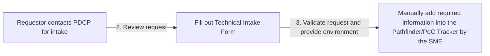

# Cloud Intake Process for PDCP

The cloud intake process for the Public Health Data Center of Excellence (PDCP) is designed to ensure that all requests for cloud services are properly validated, reviewed, and approved, and that all necessary technical and administrative information is collected before deployment. The following process outlines the steps involved in the cloud intake process:

## Standard Intake Process

1. The cloud intake request form is supplied to the requestor.
    * Cloud Intake Request Form
2. The request is received by the PDCP intake team and validated as cloud.
3. The request is reviewed by the Architecture and Technical Advisory Committee (ATAC) and assigned to the cloud team (PDCP).
4. The PDCP approves the request and enters an automated entry into the Pathfinder/PoC Tracker.
5. The requestor is asked to fill out the Technical Intake Form.
    * Technical Intake Form
6. An automated entry is entered into a Task Tracker (TBD – DevOps/Planner/Other).

## Expedited Intake Process

1. The requestor is in direct contact with the PDCP for intake.
2. The PDCP may require documentation, if so they will send the requestor through the regular intake and expedite the form processing. If not, proceed to step 3.
3. The requestor is asked to fill out the Technical Intake Form.
4. The request is validated and the environment is provided.
5. The required information is manually added into the Pathfinder/PoC Tracker by the SME.

Note: In order to use the Technical Intake Form, the requestor must have access to the PDCP's cloud services and be a member of the PDCP Team Site. In order to do this, a Team Owner must add them and they will receive a link through e-mail for the request. They will then be prompted to set up their Multi-Factor Authentication. Once this is complete and they have access to the site, they will be able to use the Technical Intake Form.

## Conclusion

The cloud intake process outlined in this document is designed to ensure that all requests for cloud services are properly validated, reviewed, and approved, and that all necessary technical and administrative information is collected before deployment. By following this cloud intake process, the PDCP can ensure that all cloud services are deployed securely and effectively, and that they comply with relevant laws, regulations, and guidelines.
