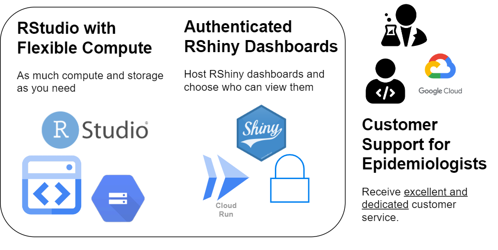

# Epidemiologist R Analytics Environment (Beta)

>[!IMPORTANT]
>This offering is currently in Beta. At this time, we can accommodate **UNCLASSIFIED** workloads.

The Epidemiologist R Analytics Environment is an environment that enables Epidemiologists to engage in analytics and information product management. This environment is suitable for both short-lived "ad-hoc" experimentation as well as long-term management of information products.

## Description

There are three primary goals of this service offering:

- Provide epidemiologists with a familiar RStudio development environment, along with the ability to use as much or as little compute and storage as they require.

- Provide epidemiologists with the ability to securely deploy RShiny dashboards, along with the ability to control who has permission to view the contents of the dashboards.

- Dedicated and involved customer support from our IT staff. Getting started in a new cloud environment can be challenging, our staff can help as much or as little as is needed for your project to succeed on our environment.

## Features

- **Scalable Data Storage**: [Google Cloud Storage buckets](https://cloud.google.com/storage/docs/json_api/v1/buckets) allow you to store as much data as you need.
- **Scalable Compute**: Choose from any of the supported [GCP available machine types](https://cloud.google.com/workstations/docs/available-machine-types). At the time of writing, you can use as little as 1 vCPU and 4 GB memory or as much as 96 vCPU and 360 GB memory, depending on your requirements.
- **Authenticated RShiny Dashboard Hosting**: Host your RShiny dashboard behind a layer of authentication, verifying users' identities before they can access the dashboard.

## Who Uses This?

This offering is geared towards epidemiologists who either produce an information product(s) on an ongoing basis, or who need an analytics environment for a project with a known start and end date.

## Key Benefits

- **Familiar Tools, Lots of Flexibility**: Epidemiologists can use RStudio and RShiny tools they are familiar with, with the flexibility of the cloud.
- **Dedicated IT Support**: Our IT staff will personally help you onboard your projects and provide you with the assistance you need to succeed.
- **Share Insights**: Epidemiologists can host internal RShiny dashboards on demand.

## Use Cases / Playbooks

- **Information Products**: Develop information products to be disseminated on an ongoing basis.
- **Collaborative Research Projects**: Facilitate collaborative projects across various disciplines.
- **Prototyping and Experimentation**: Iterate fast, and test the value of new ideas.

## Success Stories

- Currently looking for candidate projects.

## Getting Started

For access to the Epidemiologist R Analytics Environment and guidelines on its use, please contact the Analytics Infrastructure team in DPI.

## Limitations

- **Data Sensitivity**: Currently intended for use with UNCLASSIFIED public health data (PROTECTED-B workloads are on the road map but the environment is not ready for this level of sensitivity yet).
- **User Responsibility**: Users are responsible for the management of their data within the platform. This is intentional, as we don't want user workloads to depend on our staff's capacity to perform specific tasks.

## Service Capacity

As we are searching for use cases, the first few projects will receive extensive support from the Analytics Infrastructure team in DPI. If enough users enjoy this service offering, we may ammend our service capacity to reflect increased demand.

## Service Timelines

The Research Workbench is available for immediate use with best effort levels support.
